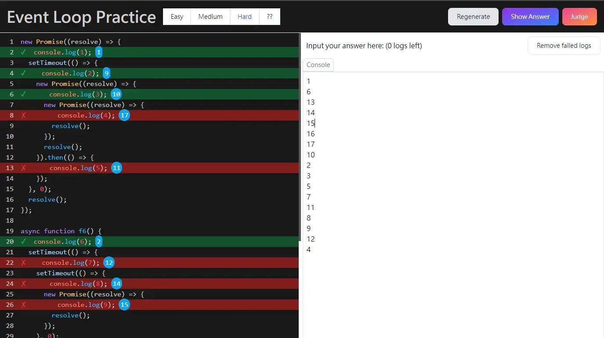

# Event Loop Practice

This is an online event loop practice tool(?).

If help you, please give me a star.

[Link](https://laijunbin.github.io/event-loop-practice/)

---

## DEMO

---

## Why I made this tool?

I think the event loop is a very important concept in JavaScript, but it is not easy for beginners to understand.

I think the best way to understand it is to practice it.

So I made this tool.

On the other hand, I want to write a post about the event loop, and I want to share this tool in the post.

---

## Why not Open Source?

Because I have no time to refactor the code. and I think this practice tool does not much necessary to be open source.

If have any issues or suggestions, please create an issue in this repository.

---

## How I implement this tool?

If you're curious how I implemented this tool, the libraries used are listed below.

- [svelte](https://svelte.dev/)
- [tailwindcss](https://tailwindcss.com/)
- [highlight.js](https://highlightjs.org/)
- [highlightjs-line-numbers.js](https://github.com/wcoder/highlightjs-line-numbers.js)
- [sweetalert2](https://sweetalert2.github.io/)

And use [vite](https://vitejs.dev/) + [lai-cmd](https://github.com/laijunbin/lai-cmd) to create a development environment.
